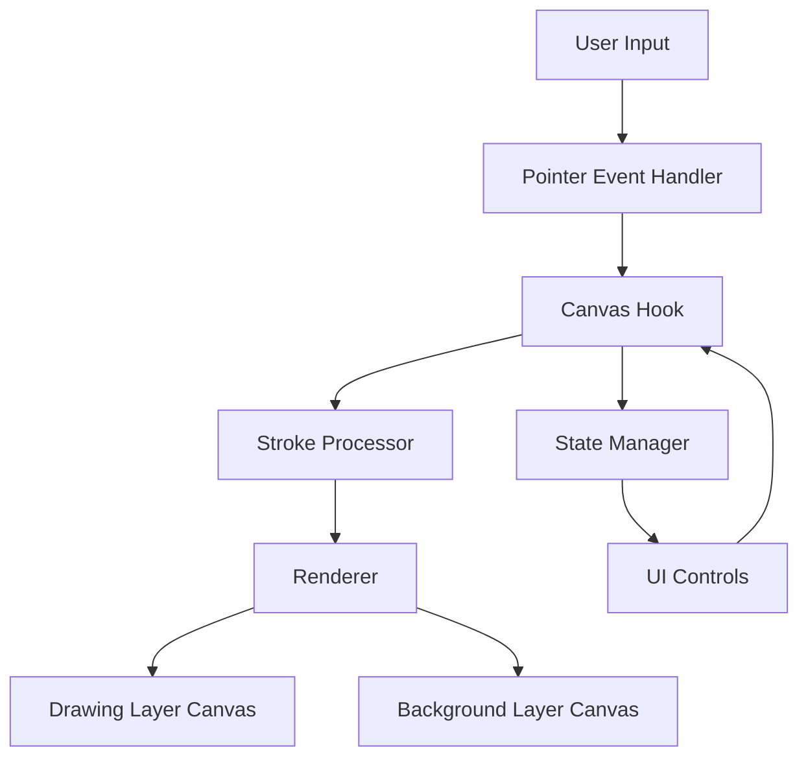
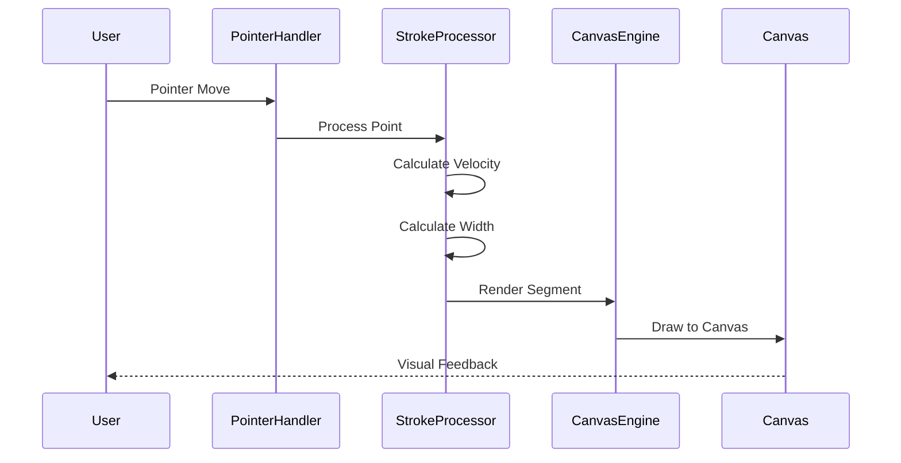

# Design Document: Doodle Canvas Application

## Overview

The Doodle Canvas application is a browser-based drawing tool built with Next.js and React that provides a natural, low-latency drawing experience. The system uses HTML5 Canvas API for rendering and supports multiple brush types, colors, and canvas backgrounds. The architecture prioritizes performance by isolating canvas operations from React's render cycle and using requestAnimationFrame for smooth rendering.

The application consists of three main layers:
1. **UI Layer**: React components for controls (color picker, brush selector, size slider)
2. **Canvas Engine**: Core drawing logic isolated in a custom React hook
3. **Rendering Layer**: Direct canvas manipulation using Canvas 2D API

## Architecture

### High-Level Architecture



### Component Structure

```
app/
├── page.tsx                    # Main canvas page
├── components/
│   ├── Canvas.tsx             # Canvas component wrapper
│   ├── Controls.tsx           # Control panel container
│   ├── ColorPicker.tsx        # Color selection control
│   ├── BrushSelector.tsx      # Brush type selector
│   ├── SizeSlider.tsx         # Brush size slider
│   ├── BackgroundSelector.tsx # Background style selector
│   └── ClearButton.tsx        # Clear canvas button
├── hooks/
│   └── useCanvas.ts           # Core canvas logic hook
├── lib/
│   ├── canvas-engine.ts       # Canvas rendering engine
│   ├── stroke-processor.ts    # Stroke smoothing and processing
│   ├── background-renderer.ts # Background pattern rendering
│   └── types.ts               # TypeScript type definitions
└── styles/
    └── globals.css            # Tailwind CSS configuration
```

### Technology Stack

- **Framework**: Next.js 14 with App Router
- **UI Library**: React 18
- **Styling**: Tailwind CSS
- **Language**: TypeScript
- **Canvas API**: HTML5 Canvas 2D Context
- **Input Handling**: Pointer Events API

## Components and Interfaces

### Core Types

```typescript
// lib/types.ts

export type BrushType = 'ink' | 'marker' | 'pencil' | 'pixel';

export type BackgroundStyle = 'plain' | 'ruled' | 'dotted' | 'grid';

export interface Point {
  x: number;
  y: number;
  pressure?: number;
  timestamp: number;
}

export interface Stroke {
  points: Point[];
  color: string;
  brushType: BrushType;
  baseWidth: number;
}

export interface CanvasConfig {
  color: string;
  brushType: BrushType;
  brushSize: number;
  backgroundStyle: BackgroundStyle;
}

export interface CanvasState {
  isDrawing: boolean;
  currentStroke: Point[];
  strokes: Stroke[];
  config: CanvasConfig;
}
```

### Canvas Hook Interface

```typescript
// hooks/useCanvas.ts

export interface UseCanvasReturn {
  // Refs for canvas elements
  drawingCanvasRef: RefObject<HTMLCanvasElement>;
  backgroundCanvasRef: RefObject<HTMLCanvasElement>;
  
  // Event handlers
  handlePointerDown: (e: PointerEvent) => void;
  handlePointerMove: (e: PointerEvent) => void;
  handlePointerUp: (e: PointerEvent) => void;
  
  // Configuration methods
  setColor: (color: string) => void;
  setBrushType: (type: BrushType) => void;
  setBrushSize: (size: number) => void;
  setBackgroundStyle: (style: BackgroundStyle) => void;
  clearCanvas: () => void;
  
  // Current state
  config: CanvasConfig;
}

export function useCanvas(): UseCanvasReturn;
```

### Canvas Engine Interface

```typescript
// lib/canvas-engine.ts

export class CanvasEngine {
  private drawingCtx: CanvasRenderingContext2D;
  private backgroundCtx: CanvasRenderingContext2D;
  private dpr: number;
  
  constructor(
    drawingCanvas: HTMLCanvasElement,
    backgroundCanvas: HTMLCanvasElement
  );
  
  // Setup and configuration
  setupCanvas(): void;
  updateBackground(style: BackgroundStyle): void;
  
  // Drawing operations
  beginStroke(point: Point): void;
  addPointToStroke(point: Point): void;
  endStroke(): void;
  clear(): void;
  
  // Rendering
  private renderStroke(stroke: Stroke): void;
  private renderSmoothStroke(points: Point[], color: string, baseWidth: number): void;
  private renderPixelStroke(points: Point[], color: string, width: number): void;
}
```

### Stroke Processor Interface

```typescript
// lib/stroke-processor.ts

export class StrokeProcessor {
  // Smoothing using quadratic Bezier curves
  static smoothPoints(points: Point[]): Point[];
  
  // Velocity calculation
  static calculateVelocity(p1: Point, p2: Point): number;
  
  // Dynamic width calculation based on velocity
  static calculateWidth(
    velocity: number,
    baseWidth: number,
    brushType: BrushType
  ): number;
  
  // Snap to grid for pixel pen
  static snapToGrid(point: Point, gridSize: number): Point;
}
```

### Background Renderer Interface

```typescript
// lib/background-renderer.ts

export class BackgroundRenderer {
  static renderPlain(
    ctx: CanvasRenderingContext2D,
    width: number,
    height: number
  ): void;
  
  static renderRuled(
    ctx: CanvasRenderingContext2D,
    width: number,
    height: number,
    lineSpacing: number
  ): void;
  
  static renderDotted(
    ctx: CanvasRenderingContext2D,
    width: number,
    height: number,
    dotSpacing: number
  ): void;
  
  static renderGrid(
    ctx: CanvasRenderingContext2D,
    width: number,
    height: number,
    gridSize: number
  ): void;
}
```

## Data Models

### Canvas State Management

The application uses React state within the `useCanvas` hook to manage configuration, but keeps drawing state (current stroke, stroke history) in a ref to avoid triggering re-renders during active drawing.

```typescript
// State stored in React state (triggers re-renders)
const [config, setConfig] = useState<CanvasConfig>({
  color: '#000000',
  brushType: 'ink',
  brushSize: 3,
  backgroundStyle: 'plain'
});

// State stored in ref (no re-renders)
const stateRef = useRef<CanvasState>({
  isDrawing: false,
  currentStroke: [],
  strokes: [],
  config: config
});
```

### Stroke Data Structure

Strokes are stored as arrays of points with metadata. Each point includes:
- **x, y**: Canvas coordinates
- **pressure**: Optional pressure data from stylus (0-1)
- **timestamp**: Time in milliseconds for velocity calculation

### High-DPI Scaling

The canvas uses device pixel ratio (DPR) scaling to support retina displays:

```typescript
const dpr = window.devicePixelRatio || 1;
canvas.width = canvas.clientWidth * dpr;
canvas.height = canvas.clientHeight * dpr;
ctx.scale(dpr, dpr);
```

This ensures crisp rendering on high-resolution displays while maintaining logical coordinate system for drawing.

## Data Flow

### Drawing Flow

1. **Pointer Down**: User starts drawing
   - Capture pointer position
   - Create new stroke with initial point
   - Set `isDrawing` flag to true

2. **Pointer Move**: User continues drawing
   - If not drawing, ignore event
   - Capture pointer position and timestamp
   - Calculate velocity from previous point
   - Add point to current stroke
   - Render stroke segment using requestAnimationFrame

3. **Pointer Up**: User finishes stroke
   - Add final point to stroke
   - Save complete stroke to history
   - Render final stroke to canvas
   - Set `isDrawing` flag to false

### Rendering Pipeline



### Configuration Updates

When users change settings (color, brush type, size, background):
1. UI component calls setter function from `useCanvas` hook
2. Hook updates config state (triggers re-render of UI)
3. Hook updates ref state (used for next stroke)
4. For background changes, hook immediately re-renders background canvas

## Stroke Smoothing Algorithm

### Quadratic Bezier Curve Smoothing

The smoothing algorithm connects discrete pointer points using quadratic Bezier curves:

```typescript
// For each triplet of points (p0, p1, p2):
// - p0 and p2 are endpoints
// - p1 is the control point
// - Midpoint between p0 and p1 becomes the start
// - Midpoint between p1 and p2 becomes the end

function smoothStroke(points: Point[], ctx: CanvasRenderingContext2D) {
  if (points.length < 2) return;
  
  ctx.beginPath();
  ctx.moveTo(points[0].x, points[0].y);
  
  for (let i = 1; i < points.length - 1; i++) {
    const p0 = points[i];
    const p1 = points[i + 1];
    
    // Control point is current point
    // End point is midpoint to next point
    const midX = (p0.x + p1.x) / 2;
    const midY = (p0.y + p1.y) / 2;
    
    ctx.quadraticCurveTo(p0.x, p0.y, midX, midY);
  }
  
  // Draw final segment to last point
  const last = points[points.length - 1];
  ctx.lineTo(last.x, last.y);
  ctx.stroke();
}
```

### Velocity-Based Width Calculation

Stroke width varies based on pointer velocity to simulate natural pen behavior:

```typescript
function calculateWidth(
  velocity: number,
  baseWidth: number,
  brushType: BrushType
): number {
  // Different brushes have different velocity sensitivity
  const sensitivity = {
    ink: 0.5,      // Moderate response
    marker: 0.1,   // Minimal response (consistent width)
    pencil: 0.8,   // High response (varies significantly)
    pixel: 0       // No response (fixed width)
  };
  
  const factor = sensitivity[brushType];
  
  // Inverse relationship: faster = thinner
  // velocity is in pixels per millisecond
  const velocityFactor = 1 / (1 + velocity * factor);
  
  // Calculate width with min/max bounds
  const width = baseWidth * velocityFactor;
  const minWidth = baseWidth * 0.5;
  const maxWidth = baseWidth * 2;
  
  return Math.max(minWidth, Math.min(maxWidth, width));
}
```

### Snap-to-Grid Algorithm

For pixel pen on grid background, pointer positions snap to grid intersections:

```typescript
function snapToGrid(point: Point, gridSize: number): Point {
  return {
    x: Math.round(point.x / gridSize) * gridSize,
    y: Math.round(point.y / gridSize) * gridSize,
    timestamp: point.timestamp
  };
}
```

## Background Rendering

### Pattern Implementations

**Plain Paper**: Solid color fill
```typescript
ctx.fillStyle = '#ffffff';
ctx.fillRect(0, 0, width, height);
```

**Ruled Paper**: Horizontal lines at regular intervals
```typescript
const lineSpacing = 30; // pixels
ctx.strokeStyle = '#e0e0e0';
ctx.lineWidth = 1;

for (let y = lineSpacing; y < height; y += lineSpacing) {
  ctx.beginPath();
  ctx.moveTo(0, y);
  ctx.lineTo(width, y);
  ctx.stroke();
}
```

**Dotted Paper**: Grid of dots
```typescript
const dotSpacing = 20; // pixels
const dotRadius = 1.5;
ctx.fillStyle = '#d0d0d0';

for (let x = dotSpacing; x < width; x += dotSpacing) {
  for (let y = dotSpacing; y < height; y += dotSpacing) {
    ctx.beginPath();
    ctx.arc(x, y, dotRadius, 0, Math.PI * 2);
    ctx.fill();
  }
}
```

**Pixel Grid**: Square grid
```typescript
const gridSize = 16; // pixels
ctx.strokeStyle = '#e0e0e0';
ctx.lineWidth = 1;

// Vertical lines
for (let x = 0; x <= width; x += gridSize) {
  ctx.beginPath();
  ctx.moveTo(x, 0);
  ctx.lineTo(x, height);
  ctx.stroke();
}

// Horizontal lines
for (let y = 0; y <= height; y += gridSize) {
  ctx.beginPath();
  ctx.moveTo(0, y);
  ctx.lineTo(width, y);
  ctx.stroke();
}
```

## Performance Optimizations

### RequestAnimationFrame for Rendering

All drawing operations use requestAnimationFrame to synchronize with browser refresh rate:

```typescript
let rafId: number | null = null;

function scheduleRender() {
  if (rafId !== null) return; // Already scheduled
  
  rafId = requestAnimationFrame(() => {
    renderCurrentStroke();
    rafId = null;
  });
}
```

### Avoiding React Re-renders

Drawing state is stored in refs to prevent triggering React re-renders during active drawing:

```typescript
// ❌ Bad: Triggers re-render on every point
const [currentStroke, setCurrentStroke] = useState<Point[]>([]);

// ✅ Good: No re-renders during drawing
const currentStrokeRef = useRef<Point[]>([]);
```

### Canvas Layer Separation

Using separate canvases for background and drawing layers prevents unnecessary redraws:
- Background canvas: Rendered once when style changes
- Drawing canvas: Rendered continuously during drawing

### Event Handler Optimization

Pointer event handlers are attached directly to canvas element (not through React props) to minimize overhead:

```typescript
useEffect(() => {
  const canvas = canvasRef.current;
  if (!canvas) return;
  
  canvas.addEventListener('pointerdown', handlePointerDown);
  canvas.addEventListener('pointermove', handlePointerMove);
  canvas.addEventListener('pointerup', handlePointerUp);
  
  return () => {
    canvas.removeEventListener('pointerdown', handlePointerDown);
    canvas.removeEventListener('pointermove', handlePointerMove);
    canvas.removeEventListener('pointerup', handlePointerUp);
  };
}, []);
```

## Error Handling

### Canvas Context Errors

```typescript
const ctx = canvas.getContext('2d');
if (!ctx) {
  console.error('Failed to get 2D context');
  // Fallback: Show error message to user
  return;
}
```

### Resize Handling

```typescript
useEffect(() => {
  function handleResize() {
    try {
      setupCanvas();
      redrawAllStrokes();
      updateBackground();
    } catch (error) {
      console.error('Error during resize:', error);
    }
  }
  
  window.addEventListener('resize', handleResize);
  return () => window.removeEventListener('resize', handleResize);
}, []);
```

### Invalid Configuration

```typescript
function setBrushSize(size: number) {
  // Clamp to valid range
  const clampedSize = Math.max(1, Math.min(50, size));
  setConfig(prev => ({ ...prev, brushSize: clampedSize }));
}
```

## Testing Strategy

The application will use a dual testing approach combining unit tests and property-based tests:

### Unit Testing
- Test specific examples of stroke smoothing with known point sequences
- Test edge cases: empty strokes, single-point strokes, rapid pointer movements
- Test UI component rendering and user interactions
- Test background pattern rendering for each style
- Test configuration updates and state management
- Test error conditions: missing canvas context, invalid brush sizes

### Property-Based Testing
- Test universal properties across randomized inputs
- Use fast-check library for TypeScript property-based testing
- Configure each property test to run minimum 100 iterations
- Tag each test with feature name and property number

Property tests will validate the correctness properties defined in the next section. Each property test will generate random inputs (points, colors, brush types, etc.) and verify that the specified property holds across all generated cases.


## Correctness Properties

A property is a characteristic or behavior that should hold true across all valid executions of a system—essentially, a formal statement about what the system should do. Properties serve as the bridge between human-readable specifications and machine-verifiable correctness guarantees.

### Property 1: Canvas Responsive Resizing

*For any* viewport size change, the canvas dimensions should adjust to match the new viewport width and height.

**Validates: Requirements 1.2**

### Property 2: High-DPI Scaling Correctness

*For any* device pixel ratio value, the canvas internal resolution (width × height) should equal the CSS dimensions multiplied by the device pixel ratio.

**Validates: Requirements 1.3**

### Property 3: Stroke Lifecycle Completeness

*For any* sequence of pointer events (down, moves, up), the system should create a stroke containing all pointer positions from down through up events.

**Validates: Requirements 2.1, 2.2, 2.3**

### Property 4: Multi-Device Input Support

*For any* pointer event type (mouse, touch, stylus), the system should process the event and add the position to the current stroke.

**Validates: Requirements 2.4**

### Property 5: Velocity Calculation Consistency

*For any* two consecutive points with known positions and timestamps, the calculated velocity should equal the distance divided by the time difference.

**Validates: Requirements 2.5**

### Property 6: Smooth Brush Stroke Smoothing

*For any* stroke with brush type of ink, marker, or pencil, the rendered path should use quadratic Bezier curves rather than straight line segments.

**Validates: Requirements 3.1**

### Property 7: Pixel Pen No Smoothing

*For any* stroke with brush type of pixel pen, the rendered path should connect points with straight line segments without curve smoothing.

**Validates: Requirements 3.2**

### Property 8: Velocity-Width Inverse Relationship

*For any* two strokes with the same brush type and base width, the stroke with higher average velocity should have smaller average rendered width than the stroke with lower velocity.

**Validates: Requirements 4.1, 4.2, 4.3**

### Property 9: Stroke Width Bounds

*For any* stroke with base width W, all rendered segments should have width between W × 0.5 and W × 2.0.

**Validates: Requirements 4.4**

### Property 10: Pixel Pen Fixed Width

*For any* stroke with brush type of pixel pen, all segments should have the same width regardless of velocity.

**Validates: Requirements 5.5**

### Property 11: Color Application

*For any* stroke drawn with color C, all segments of that stroke should be rendered in color C.

**Validates: Requirements 6.1**

### Property 12: Color Change Isolation

*For any* sequence where color changes from C1 to C2, strokes drawn before the change should remain in C1 and strokes drawn after should be in C2.

**Validates: Requirements 6.2, 6.3**

### Property 13: Brush Size Application

*For any* stroke drawn with brush size S, the base width used for rendering should equal S.

**Validates: Requirements 7.1**

### Property 14: Brush Size Change Isolation

*For any* sequence where brush size changes from S1 to S2, strokes drawn before the change should use base width S1 and strokes drawn after should use base width S2.

**Validates: Requirements 7.2, 7.3**

### Property 15: Background Style Rendering

*For any* background style selection, the background canvas should display the corresponding pattern (plain, ruled, dotted, or grid).

**Validates: Requirements 8.2**

### Property 16: Snap-to-Grid Activation

*For any* configuration state, snap-to-grid mode should be enabled if and only if the background style is pixel grid AND the brush type is pixel pen.

**Validates: Requirements 9.1**

### Property 17: Grid Snapping Behavior

*For any* pointer position P and grid size G, when snap-to-grid is enabled, the snapped position should be the nearest point where both x and y coordinates are multiples of G.

**Validates: Requirements 9.2**

### Property 18: No Snapping When Disabled

*For any* pointer position P, when snap-to-grid is disabled, the processed position should equal P exactly.

**Validates: Requirements 9.3**

### Property 19: Clear Canvas Removes Strokes

*For any* canvas state with N strokes, after clearing the canvas, the drawing layer should contain zero strokes.

**Validates: Requirements 10.1**

### Property 20: Clear Preserves Background

*For any* background style B, after clearing the canvas, the background layer should still display style B.

**Validates: Requirements 10.2**

### Property 21: Rendering Performance

*For any* pointer move event during active drawing, the time from event receipt to canvas update should be less than 16 milliseconds.

**Validates: Requirements 11.3**

### Property 22: Configuration Update Immediacy

*For any* control interaction that changes configuration (color, brush type, size, or background), the canvas engine configuration should reflect the change before the next stroke begins.

**Validates: Requirements 12.6**

