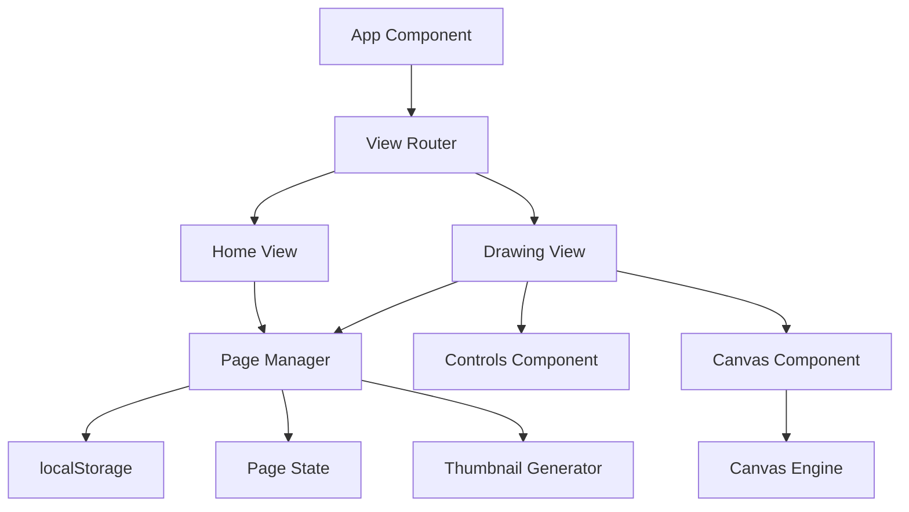
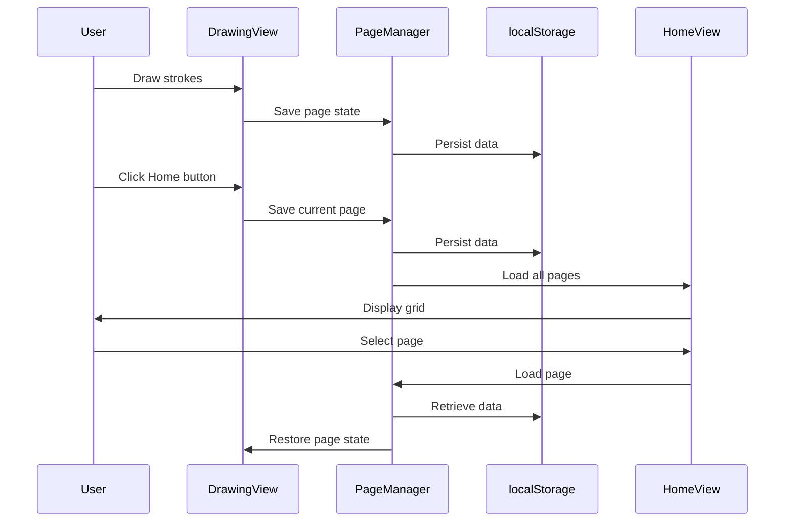

# Design Document: Page Management System

## Overview

The Page Management System extends the existing drawing application with multi-page support. The design introduces a new architectural layer for page state management, a home view for page browsing, and localStorage-based persistence. The system maintains backward compatibility with the existing canvas engine while adding page-level abstractions.

The core design principle is separation of concerns: the existing canvas engine handles drawing operations, while new components manage page lifecycle, storage, and navigation. This approach minimizes changes to tested code and provides clear boundaries between drawing and page management responsibilities.

## Architecture

### High-Level Architecture



### Component Responsibilities

1. **Page Manager**: Central state management for all pages
   - CRUD operations for pages
   - localStorage persistence
   - Active page tracking
   - Page metadata management

2. **View Router**: Controls navigation between Home and Drawing views
   - View state management
   - Transition handling
   - State preservation during navigation

3. **Home View**: Grid display of all pages
   - Page thumbnail rendering
   - Page selection handling
   - New page creation
   - Page deletion with confirmation

4. **Drawing View**: Existing canvas interface with Home button
   - Minimal changes to existing components
   - Home button integration
   - Auto-save integration

5. **Thumbnail Generator**: Creates visual previews of pages
   - Canvas-to-image conversion
   - Scaling and aspect ratio handling
   - Background + drawing layer composition

### Data Flow



## Components and Interfaces

### Page Data Model

```typescript
interface Page {
  id: string;                    // Unique identifier (UUID)
  name: string;                  // User-defined name
  strokes: Stroke[];             // Array of drawing strokes
  backgroundStyle: BackgroundStyle; // Background style
  thumbnail: string;             // Base64-encoded thumbnail image
  createdAt: number;             // Unix timestamp
  lastModifiedAt: number;        // Unix timestamp
}

interface PageMetadata {
  id: string;
  name: string;
  thumbnail: string;
  createdAt: number;
  lastModifiedAt: number;
}
```

### Page Manager Interface

```typescript
interface PageManager {
  // Page CRUD operations
  createPage(name?: string): Page;
  getPage(id: string): Page | null;
  getAllPages(): PageMetadata[];
  updatePage(id: string, updates: Partial<Page>): void;
  deletePage(id: string): void;
  
  // Active page management
  getActivePage(): Page | null;
  setActivePage(id: string): void;
  
  // Persistence
  savePage(page: Page): void;
  loadPages(): void;
  
  // Thumbnail generation
  generateThumbnail(canvas: HTMLCanvasElement): string;
}
```

### View State Management

```typescript
type View = 'home' | 'drawing';

interface ViewState {
  currentView: View;
  previousView: View | null;
  activePageId: string | null;
}
```

### Home View Component Interface

```typescript
interface HomeViewProps {
  pages: PageMetadata[];
  onPageSelect: (pageId: string) => void;
  onPageDelete: (pageId: string) => void;
  onNewPage: () => void;
  onPageRename: (pageId: string, newName: string) => void;
}
```

### Drawing View Modifications

The existing Canvas component requires minimal changes:

```typescript
interface CanvasProps {
  // Existing props remain unchanged
  // New props:
  onHomeClick: () => void;
  pageId: string;
  initialState?: {
    strokes: Stroke[];
    backgroundStyle: BackgroundStyle;
  };
}
```

## Data Models

### localStorage Schema

Pages are stored in localStorage with the following structure:

```typescript
// Key: 'doodle-pages'
// Value: JSON string of PageStorage
interface PageStorage {
  pages: Record<string, Page>;  // Map of page ID to Page
  activePageId: string | null;
  version: number;              // Schema version for migrations
}
```

### Default Values

```typescript
const DEFAULT_PAGE_NAME = 'Untitled Page';
const DEFAULT_BACKGROUND = 'plain';
const THUMBNAIL_WIDTH = 300;
const THUMBNAIL_HEIGHT = 200;
const MAX_PAGE_NAME_LENGTH = 100;
const STORAGE_KEY = 'doodle-pages';
const STORAGE_VERSION = 1;
```

### Page Naming Convention

- New pages: "Untitled Page 1", "Untitled Page 2", etc.
- Sequential numbering based on existing page count
- User can rename to any string (1-100 characters)

## Implementation Details

### Page Manager Implementation

The Page Manager will be implemented as a React hook (`usePageManager`) that provides:

1. **State Management**: Uses React state for in-memory page data
2. **localStorage Sync**: Automatic persistence on state changes
3. **Debounced Saves**: Debounce auto-save to prevent excessive writes (1 second delay)
4. **Error Handling**: Graceful handling of localStorage quota errors

```typescript
function usePageManager() {
  const [pages, setPages] = useState<Record<string, Page>>({});
  const [activePageId, setActivePageId] = useState<string | null>(null);
  
  // Load pages from localStorage on mount
  useEffect(() => {
    loadPages();
  }, []);
  
  // Auto-save with debouncing
  useEffect(() => {
    const timeoutId = setTimeout(() => {
      persistToStorage();
    }, 1000);
    
    return () => clearTimeout(timeoutId);
  }, [pages, activePageId]);
  
  // ... implementation details
}
```

### Thumbnail Generation

Thumbnails are generated by:

1. Creating an off-screen canvas
2. Drawing both background and drawing layers to it
3. Scaling to thumbnail dimensions (300x200)
4. Converting to base64 data URL (JPEG format, 80% quality)

```typescript
function generateThumbnail(
  drawingCanvas: HTMLCanvasElement,
  backgroundCanvas: HTMLCanvasElement
): string {
  const offscreen = document.createElement('canvas');
  offscreen.width = THUMBNAIL_WIDTH;
  offscreen.height = THUMBNAIL_HEIGHT;
  
  const ctx = offscreen.getContext('2d')!;
  
  // Draw background layer (scaled)
  ctx.drawImage(backgroundCanvas, 0, 0, THUMBNAIL_WIDTH, THUMBNAIL_HEIGHT);
  
  // Draw drawing layer (scaled)
  ctx.drawImage(drawingCanvas, 0, 0, THUMBNAIL_WIDTH, THUMBNAIL_HEIGHT);
  
  // Convert to base64 JPEG
  return offscreen.toDataURL('image/jpeg', 0.8);
}
```

### View Navigation

Navigation between views is managed by a simple state machine:

```typescript
function useViewNavigation() {
  const [viewState, setViewState] = useState<ViewState>({
    currentView: 'home',
    previousView: null,
    activePageId: null,
  });
  
  const navigateToHome = () => {
    setViewState(prev => ({
      currentView: 'home',
      previousView: prev.currentView,
      activePageId: prev.activePageId,
    }));
  };
  
  const navigateToDrawing = (pageId: string) => {
    setViewState(prev => ({
      currentView: 'drawing',
      previousView: prev.currentView,
      activePageId: pageId,
    }));
  };
  
  return { viewState, navigateToHome, navigateToDrawing };
}
```

### Home Button Integration

The Home button is added to the Controls component:

```typescript
// In Controls.tsx
<div className="border-b border-gray-200 pb-2 mb-2">
  <button
    onClick={onHomeClick}
    className="w-full px-3 py-2 rounded-lg font-bold bg-blue-500 hover:bg-blue-600 text-white mb-2"
  >
    🏠 Home
  </button>
  <h2 className="text-lg font-bold">🎨 Drawing Tools</h2>
</div>
```

### Auto-Save Strategy

Pages are automatically saved in the following scenarios:

1. **Stroke completion**: After each stroke is added (debounced 1 second)
2. **Background change**: Immediately when background style changes
3. **Page name change**: Immediately when user renames a page
4. **View navigation**: Before switching from drawing to home view

### localStorage Error Handling

```typescript
function saveToLocalStorage(data: PageStorage): boolean {
  try {
    const json = JSON.stringify(data);
    localStorage.setItem(STORAGE_KEY, json);
    return true;
  } catch (error) {
    if (error instanceof DOMException && error.name === 'QuotaExceededError') {
      // Notify user that storage is full
      console.error('localStorage quota exceeded');
      // Could implement: delete oldest pages, compress data, or show UI warning
      return false;
    }
    console.error('Failed to save to localStorage:', error);
    return false;
  }
}
```

### Page Deletion Confirmation

Deletion requires user confirmation to prevent accidental data loss:

```typescript
function handleDeletePage(pageId: string) {
  const page = getPage(pageId);
  if (!page) return;
  
  const confirmed = window.confirm(
    `Are you sure you want to delete "${page.name}"? This cannot be undone.`
  );
  
  if (confirmed) {
    deletePage(pageId);
  }
}
```

### Responsive Grid Layout

The home view grid uses CSS Grid with responsive breakpoints:

```css
.page-grid {
  display: grid;
  grid-template-columns: repeat(auto-fill, minmax(300px, 1fr));
  gap: 1.5rem;
  padding: 1.5rem;
}

@media (max-width: 640px) {
  .page-grid {
    grid-template-columns: 1fr;
  }
}
```


## Correctness Properties

A property is a characteristic or behavior that should hold true across all valid executions of a system—essentially, a formal statement about what the system should do. Properties serve as the bridge between human-readable specifications and machine-verifiable correctness guarantees.

### Property 1: Page Persistence Round-Trip

*For any* page with strokes, background style, and metadata, saving the page to localStorage and then loading it back should produce an equivalent page with all data intact.

**Validates: Requirements 1.2, 1.3, 1.4, 8.2, 8.3, 9.4**

### Property 2: Unique Page Identifiers

*For any* set of pages in the system, all page IDs should be unique, and each page's ID should remain unchanged across save/load cycles.

**Validates: Requirements 1.5, 10.5**

### Property 3: Sequential Default Naming

*For any* number N of existing pages, creating a new page should assign it a default name in the format "Untitled Page M" where M = N + 1.

**Validates: Requirements 1.1, 2.1**

### Property 4: Page Name Update Round-Trip

*For any* page and any valid new name (non-empty, ≤100 characters), updating the page name and reloading from localStorage should preserve the new name.

**Validates: Requirements 2.2, 2.4**

### Property 5: Invalid Name Rejection

*For any* page and any string composed entirely of whitespace or exceeding 100 characters, attempting to update the page name should be rejected and the current name should remain unchanged.

**Validates: Requirements 2.3, 2.5**

### Property 6: Home Button Presence

*For any* state in Drawing View, the Home button element should be present in the DOM and positioned above the Drawing Tools panel.

**Validates: Requirements 3.1**

### Property 7: View Navigation State Transition

*For any* view state (home or drawing), triggering navigation to the other view should result in the view state changing to the target view.

**Validates: Requirements 3.2, 6.2**

### Property 8: Data Preservation During Navigation

*For any* page with unsaved changes (new strokes or background changes), navigating from Drawing View to Home View should preserve all changes in the page data.

**Validates: Requirements 3.3, 3.5**

### Property 9: Complete Page Display

*For any* set of saved pages, displaying the Home View should show all pages in the grid with each page's thumbnail, name, and last modified date visible.

**Validates: Requirements 4.1, 4.2**

### Property 10: Page Selection Navigation

*For any* page displayed in the Home View grid, clicking on that page should navigate to Drawing View with that page loaded as the active page.

**Validates: Requirements 4.4**

### Property 11: Reverse Chronological Ordering

*For any* set of pages with different lastModifiedAt timestamps, the Home View grid should display them in reverse chronological order (most recent first).

**Validates: Requirements 4.5**

### Property 12: Complete Thumbnail Generation

*For any* page with a background style and strokes, generating a thumbnail should produce a valid image that includes both the background layer and all drawing strokes, scaled to consistent dimensions.

**Validates: Requirements 5.1, 5.2, 5.3**

### Property 13: View State Preservation

*For any* sequence of view navigations (home → drawing → home), the Home View state (scroll position, displayed pages) should be preserved when returning to it.

**Validates: Requirements 6.3**

### Property 14: Active Page Restoration

*For any* active page in Drawing View, navigating to Home View and then back to Drawing View without selecting a different page should restore the same active page.

**Validates: Requirements 6.4**

### Property 15: Delete Option Availability

*For any* page displayed in Home View, a delete option should be available and accessible for that page.

**Validates: Requirements 7.1**

### Property 16: Deletion Confirmation Flow

*For any* page deletion attempt, the system should display a confirmation dialog before proceeding with the deletion.

**Validates: Requirements 7.2**

### Property 17: Permanent Page Deletion

*For any* page that is confirmed for deletion, the page should be completely removed from localStorage and should not appear in subsequent page listings.

**Validates: Requirements 7.3, 7.4**

### Property 18: Graceful Error Handling

*For any* localStorage error (quota exceeded, access denied, etc.), the system should handle the error without crashing and should continue to function with in-memory state.

**Validates: Requirements 8.5**

### Property 19: Complete Metadata Initialization

*For any* newly created page, the page metadata should include all required fields: id, name, createdAt, lastModifiedAt, with valid values.

**Validates: Requirements 9.1**

### Property 20: Timestamp Update on Modification

*For any* page modification (adding strokes, changing background, renaming), the lastModifiedAt timestamp should be updated to a value greater than the previous timestamp.

**Validates: Requirements 9.2**

### Property 21: Human-Readable Date Formatting

*For any* page with a lastModifiedAt timestamp, displaying the page in Home View should show the date in a human-readable format (e.g., "2 hours ago", "Jan 15, 2024").

**Validates: Requirements 9.3**

### Property 22: New Page Button Presence

*For any* state in Home View, a "New Page" button or card should be present and clickable.

**Validates: Requirements 10.1**

### Property 23: New Page Initialization

*For any* new page created via the New Page button, the page should be initialized with default settings: plain white background, empty strokes array, and a default name.

**Validates: Requirements 10.2, 10.4**

### Property 24: New Page Navigation

*For any* new page created from Home View, the system should navigate to Drawing View with the newly created page as the active page.

**Validates: Requirements 10.3**

## Error Handling

### localStorage Errors

The system must gracefully handle localStorage failures:

1. **Quota Exceeded**: 
   - Catch `QuotaExceededError`
   - Display user-friendly error message
   - Continue operating with in-memory state
   - Optionally: offer to delete old pages to free space

2. **Access Denied**:
   - Catch `SecurityError` (private browsing, disabled storage)
   - Display informational message
   - Operate in memory-only mode
   - Warn user that data won't persist

3. **Corrupted Data**:
   - Validate JSON structure on load
   - Use default values for missing/invalid fields
   - Log errors for debugging
   - Continue with partial data recovery

### Page Data Validation

When loading pages from localStorage:

```typescript
function validatePage(data: any): Page | null {
  try {
    // Validate required fields
    if (!data.id || typeof data.id !== 'string') return null;
    if (!data.name || typeof data.name !== 'string') return null;
    if (!Array.isArray(data.strokes)) return null;
    if (!data.backgroundStyle) return null;
    
    // Validate timestamps
    if (typeof data.createdAt !== 'number' || data.createdAt <= 0) return null;
    if (typeof data.lastModifiedAt !== 'number' || data.lastModifiedAt <= 0) return null;
    
    // Validate thumbnail
    if (!data.thumbnail || typeof data.thumbnail !== 'string') return null;
    
    return data as Page;
  } catch (error) {
    console.error('Page validation failed:', error);
    return null;
  }
}
```

### Navigation Edge Cases

1. **Deleting Active Page**: If the currently active page is deleted while in Home View, clear the active page reference to prevent loading a non-existent page.

2. **Empty Page List**: When no pages exist, show an empty state with a prominent "Create Your First Page" call-to-action.

3. **Concurrent Modifications**: Since this is a single-user application, concurrent modifications are not a concern. However, if multiple tabs are open, the last write wins (standard localStorage behavior).

## Testing Strategy

The Page Management System will be tested using a dual approach: unit tests for specific examples and edge cases, and property-based tests for universal correctness properties.

### Unit Testing

Unit tests will focus on:

1. **Specific Examples**: Test concrete scenarios like creating a page named "My Drawing", deleting a specific page, etc.
2. **Edge Cases**: Test empty page lists, maximum name length, localStorage quota errors, corrupted data recovery
3. **Integration Points**: Test interactions between Page Manager and Canvas Engine, view navigation flows
4. **UI Components**: Test Home View rendering, thumbnail display, delete confirmation dialogs

Unit tests should be concise and focused. Avoid writing too many unit tests for scenarios that property tests will cover comprehensively.

### Property-Based Testing

Property-based tests will verify universal properties across randomized inputs. The testing library for TypeScript/JavaScript is **fast-check**.

**Configuration**:
- Minimum 100 iterations per property test
- Each test tagged with: `Feature: page-management, Property N: [property description]`
- Each correctness property from the design document must have exactly one corresponding property-based test

**Example Property Test Structure**:

```typescript
import fc from 'fast-check';

// Feature: page-management, Property 1: Page Persistence Round-Trip
test('page persistence round-trip', () => {
  fc.assert(
    fc.property(
      fc.record({
        id: fc.uuid(),
        name: fc.string({ minLength: 1, maxLength: 100 }),
        strokes: fc.array(arbitraryStroke()),
        backgroundStyle: fc.constantFrom('plain', 'grid', 'dots'),
        thumbnail: fc.string(),
        createdAt: fc.integer({ min: 1 }),
        lastModifiedAt: fc.integer({ min: 1 }),
      }),
      (page) => {
        // Save page
        savePage(page);
        
        // Load page back
        const loaded = loadPage(page.id);
        
        // Verify equivalence
        expect(loaded).toEqual(page);
      }
    ),
    { numRuns: 100 }
  );
});
```

**Property Test Coverage**:
- All 24 correctness properties must be implemented as property-based tests
- Edge cases (empty page list, corrupted data, quota errors) should be tested with unit tests
- UI rendering properties should use DOM testing utilities (Testing Library)

### Test Organization

```
__tests__/
  page-manager.test.ts          # Unit tests for Page Manager
  page-manager.property.test.ts # Property tests for Page Manager
  home-view.test.tsx            # Unit tests for Home View component
  home-view.property.test.tsx   # Property tests for Home View
  view-navigation.test.ts       # Unit tests for view navigation
  view-navigation.property.test.ts # Property tests for navigation
  thumbnail-generator.test.ts   # Unit tests for thumbnail generation
  thumbnail-generator.property.test.ts # Property tests for thumbnails
```

### Testing Priorities

1. **Critical Path**: Page creation, saving, loading, navigation
2. **Data Integrity**: Persistence round-trips, unique IDs, metadata completeness
3. **Error Handling**: localStorage errors, corrupted data, edge cases
4. **UI Behavior**: View rendering, button presence, grid display
5. **Performance**: Auto-save debouncing, thumbnail generation speed (manual testing)
