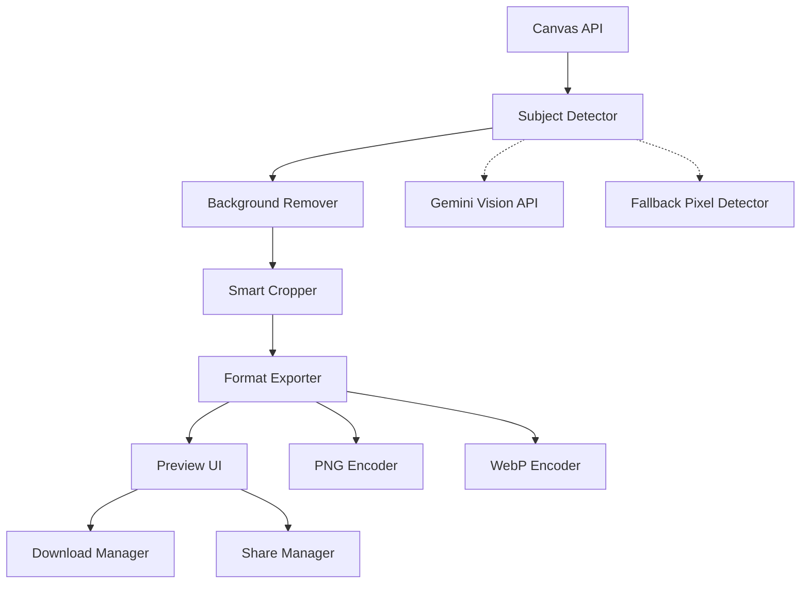

# Design Document: Sticker Creation

## Overview

The sticker creation feature transforms user doodles into shareable stickers through a multi-stage pipeline: AI-powered subject detection using Gemini Vision API, intelligent background removal, smart cropping, and multi-format export optimization. The system prioritizes quality preservation while meeting platform-specific constraints (WhatsApp's 512x512, <100KB requirements).

The architecture separates concerns into distinct modules: subject detection (AI integration), image processing (background removal and cropping), format conversion (PNG/WebP export), and UI coordination (preview and download). This separation enables independent testing of each stage and graceful fallback when AI services are unavailable.

## Architecture

### High-Level Flow

```
User Canvas → Subject Detection → Background Removal → Smart Crop → Format Export → Preview → Download/Share
```

### Component Diagram



### Data Flow

1. **Input Stage**: Canvas ImageData extraction
2. **Analysis Stage**: Gemini Vision API identifies subject boundaries
3. **Processing Stage**: Background removal and cropping operations
4. **Export Stage**: Format conversion with optimization
5. **Output Stage**: Preview display and file download/share

## Components and Interfaces

### 1. StickerCreationOrchestrator

**Responsibility**: Coordinates the entire sticker creation pipeline

**Interface**:
```typescript
interface StickerCreationOrchestrator {
  createSticker(canvas: HTMLCanvasElement): Promise<StickerResult>
  cancel(): void
}

interface StickerResult {
  preview: ImageData
  formats: {
    png: Blob
    webp?: Blob
  }
  metadata: {
    originalSize: { width: number; height: number }
    croppedSize: { width: number; height: number }
    fileSizes: { png: number; webp?: number }
  }
}
```

**Behavior**:
- Validates canvas is not empty
- Orchestrates sequential pipeline stages
- Handles errors and provides fallback mechanisms
- Emits progress events for UI updates

### 2. SubjectDetector

**Responsibility**: Identifies the main doodle body using AI or fallback methods

**Interface**:
```typescript
interface SubjectDetector {
  detectSubject(imageData: ImageData): Promise<SubjectMask>
}

interface SubjectMask {
  mask: Uint8Array  // Binary mask: 1 = subject, 0 = background
  boundingBox: BoundingBox
  confidence: number
  method: 'ai' | 'fallback'
}

interface BoundingBox {
  x: number
  y: number
  width: number
  height: number
}
```

**Implementation Details**:
- **Primary Method**: Gemini Vision API
  - Send canvas image as base64 encoded PNG
  - Request subject segmentation or bounding box
  - Parse response into SubjectMask format
  - 10-second timeout with retry logic
  
- **Fallback Method**: Pixel-based detection
  - Scan all pixels for non-transparent content
  - Use connected component analysis to identify largest blob
  - Apply morphological operations to clean up noise
  - Generate binary mask from detected region

**AI Integration**:
```typescript
interface GeminiVisionClient {
  analyzeImage(image: string, prompt: string): Promise<GeminiResponse>
}

// Prompt template for subject detection
const SUBJECT_DETECTION_PROMPT = `
Identify the main subject or drawing in this image. 
Provide the bounding box coordinates (x, y, width, height) 
of the primary subject, ignoring any background elements.
`
```

### 3. BackgroundRemover

**Responsibility**: Removes background pixels based on subject mask

**Interface**:
```typescript
interface BackgroundRemover {
  removeBackground(imageData: ImageData, mask: SubjectMask): ImageData
}
```

**Algorithm**:
1. Create new ImageData with same dimensions
2. For each pixel (x, y):
   - If mask[x, y] === 1: Copy pixel with original alpha
   - If mask[x, y] === 0: Set alpha to 0 (transparent)
3. Apply edge smoothing to prevent harsh boundaries
4. Return processed ImageData

**Edge Smoothing**:
- Apply 3x3 Gaussian blur to mask boundaries
- Blend alpha values at edges for anti-aliasing
- Preserve sharp edges where appropriate (high contrast areas)

### 4. SmartCropper

**Responsibility**: Crops image to minimal bounding box with padding

**Interface**:
```typescript
interface SmartCropper {
  crop(imageData: ImageData): CroppedResult
}

interface CroppedResult {
  imageData: ImageData
  boundingBox: BoundingBox
  padding: number
}
```

**Algorithm**:
1. Scan all pixels to find non-transparent bounds
2. Calculate minimal bounding box
3. Add padding (5-10 pixels) around bounds
4. Enforce minimum dimensions (64x64)
5. Extract sub-region from original ImageData
6. Return cropped ImageData

**Constraints**:
- Minimum size: 64x64 pixels
- Maximum size: 2048x2048 pixels (scale down if exceeded)
- Padding: 8 pixels (configurable)
- Maintain aspect ratio during scaling

### 5. FormatExporter

**Responsibility**: Converts ImageData to PNG and WebP formats with optimization

**Interface**:
```typescript
interface FormatExporter {
  exportPNG(imageData: ImageData): Promise<Blob>
  exportWebP(imageData: ImageData, maxSize: number): Promise<Blob | null>
}
```

**PNG Export**:
- Use Canvas.toBlob() with 'image/png' type
- No compression (lossless)
- Preserve full resolution up to 2048x2048

**WebP Export**:
1. Resize to 512x512 (maintain aspect ratio, center on canvas)
2. Start with quality = 0.95
3. Convert to WebP using Canvas.toBlob('image/webp', quality)
4. Check file size:
   - If < 100KB: Success, return Blob
   - If >= 100KB: Reduce quality by 0.05 and retry
   - If quality < 0.5: Give up, return null
5. Maximum 10 iterations

**Resizing Algorithm**:
```typescript
function resizeForWhatsApp(imageData: ImageData): ImageData {
  const targetSize = 512
  const scale = Math.min(targetSize / imageData.width, targetSize / imageData.height)
  
  const newWidth = Math.round(imageData.width * scale)
  const newHeight = Math.round(imageData.height * scale)
  
  // Use high-quality interpolation (bilinear or bicubic)
  const resized = resizeImageData(imageData, newWidth, newHeight)
  
  // Center on 512x512 canvas with transparent background
  return centerOnCanvas(resized, targetSize, targetSize)
}
```

### 6. PreviewUI

**Responsibility**: Displays sticker preview with download/share options

**Interface**:
```typescript
interface PreviewUI {
  show(result: StickerResult): void
  hide(): void
  onDownload(format: 'png' | 'webp'): void
  onShare(platform: 'whatsapp'): void
}
```

**UI Elements**:
- Modal overlay with semi-transparent backdrop
- Sticker preview with checkered background (indicates transparency)
- File size badges for each format
- Action buttons: Download PNG, Download WebP, Share to WhatsApp, Cancel
- Loading spinner during processing
- Error message display area

**Preview Rendering**:
```typescript
function renderPreview(imageData: ImageData): HTMLCanvasElement {
  const canvas = document.createElement('canvas')
  canvas.width = imageData.width
  canvas.height = imageData.height
  
  const ctx = canvas.getContext('2d')!
  
  // Draw checkered background
  drawCheckeredPattern(ctx, canvas.width, canvas.height)
  
  // Draw sticker on top
  ctx.putImageData(imageData, 0, 0)
  
  return canvas
}
```

### 7. DownloadManager

**Responsibility**: Handles file downloads with proper naming

**Interface**:
```typescript
interface DownloadManager {
  download(blob: Blob, format: 'png' | 'webp'): void
}
```

**Implementation**:
```typescript
function download(blob: Blob, format: 'png' | 'webp'): void {
  const timestamp = new Date().toISOString().replace(/[:.]/g, '-').slice(0, -5)
  const filename = `sticker_${timestamp}.${format}`
  
  const url = URL.createObjectURL(blob)
  const a = document.createElement('a')
  a.href = url
  a.download = filename
  a.click()
  
  // Cleanup
  setTimeout(() => URL.revokeObjectURL(url), 100)
}
```

### 8. ShareManager

**Responsibility**: Handles sharing to external platforms

**Interface**:
```typescript
interface ShareManager {
  shareToWhatsApp(blob: Blob): Promise<void>
  canShare(platform: 'whatsapp'): boolean
}
```

**Implementation**:
- Use Web Share API if available
- Fall back to platform-specific URLs (WhatsApp Web)
- Handle mobile vs desktop differences
- Provide user feedback on share status

## Data Models

### ImageData (Browser Native)
```typescript
interface ImageData {
  width: number
  height: number
  data: Uint8ClampedArray  // RGBA format: [r, g, b, a, r, g, b, a, ...]
}
```

### StickerMetadata
```typescript
interface StickerMetadata {
  createdAt: Date
  originalDimensions: { width: number; height: number }
  croppedDimensions: { width: number; height: number }
  detectionMethod: 'ai' | 'fallback'
  detectionConfidence: number
  exportFormats: Array<'png' | 'webp'>
  fileSizes: Record<string, number>
}
```

### ProcessingState
```typescript
type ProcessingStage = 
  | 'idle'
  | 'detecting'
  | 'removing-background'
  | 'cropping'
  | 'exporting'
  | 'complete'
  | 'error'

interface ProcessingState {
  stage: ProcessingStage
  progress: number  // 0-100
  error?: string
}
```


## Correctness Properties

A property is a characteristic or behavior that should hold true across all valid executions of a system—essentially, a formal statement about what the system should do. Properties serve as the bridge between human-readable specifications and machine-verifiable correctness guarantees.

### Property 1: Subject Detection Invocation

*For any* non-empty canvas image, when sticker creation is initiated, the subject detection system should be invoked with the canvas image data.

**Validates: Requirements 1.1**

### Property 2: Multi-Subject Prioritization

*For any* image containing multiple distinct subjects, the system should select the largest or most central subject as the primary doodle body.

**Validates: Requirements 1.3**

### Property 3: Detection to Removal Pipeline

*For any* completed subject detection result, the identified subject mask should be passed to the background removal stage without modification.

**Validates: Requirements 1.5**

### Property 4: Background Pixel Transparency

*For any* subject mask and image, all pixels outside the subject mask should have their alpha channel set to zero after background removal.

**Validates: Requirements 2.1**

### Property 5: Subject Color Preservation

*For any* pixel inside the subject mask, the RGB color values should remain unchanged after background removal.

**Validates: Requirements 2.2**

### Property 6: Alpha Channel Preservation

*For any* semi-transparent pixel inside the subject mask, the alpha value should be preserved exactly in the output.

**Validates: Requirements 2.3**

### Property 7: Bounding Box Calculation

*For any* image with transparent background, the calculated bounding box should encompass all pixels with alpha > 0 and no pixels with alpha = 0.

**Validates: Requirements 3.1**

### Property 8: Crop Dimensions with Padding

*For any* cropped image, the output dimensions should equal the bounding box dimensions plus padding (within the configured padding range of 5-10 pixels).

**Validates: Requirements 3.2, 3.3**

### Property 9: Aspect Ratio Preservation

*For any* image that undergoes cropping or resizing, the aspect ratio of the content should be preserved (within 1% tolerance for rounding).

**Validates: Requirements 3.5**

### Property 10: WebP Dimensions and Size

*For any* WebP export, the output image should be exactly 512x512 pixels and the file size should be less than or equal to 100KB (or export should fail gracefully).

**Validates: Requirements 4.3, 4.4**

### Property 11: Iterative Quality Reduction

*For any* WebP export that initially exceeds 100KB, the system should reduce quality in steps until the size constraint is met or minimum quality is reached.

**Validates: Requirements 4.5**

### Property 12: PNG Resolution Preservation

*For any* PNG export, the output resolution should match the input resolution up to a maximum of 2048x2048 pixels.

**Validates: Requirements 4.6**

### Property 13: Transparent Background in Exports

*For any* exported sticker (PNG or WebP), all background pixels should have alpha = 0 (fully transparent).

**Validates: Requirements 4.7**

### Property 14: Filename Format Compliance

*For any* generated filename, it should match the pattern `sticker_YYYYMMDD_HHMMSS.{ext}` where the timestamp is valid and ext is either 'png' or 'webp'.

**Validates: Requirements 7.7**

### Property 15: Error Message Display

*For any* error that occurs during sticker creation, a user-friendly error message should be displayed to the user.

**Validates: Requirements 8.7**

## Error Handling

### Error Categories

1. **Input Validation Errors**
   - Empty canvas
   - Drawing too small (< 32x32 pixels)
   - Drawing too large (> 4096x4096 pixels)
   - Invalid canvas state

2. **API Errors**
   - Gemini Vision API timeout (> 10 seconds)
   - Gemini Vision API failure (network, auth, rate limit)
   - API returns invalid response format

3. **Processing Errors**
   - Background removal fails
   - Cropping produces invalid dimensions
   - Format conversion fails

4. **Export Errors**
   - WebP compression cannot meet size constraint
   - Browser doesn't support WebP
   - File download fails
   - Share API unavailable

### Error Handling Strategy

**Graceful Degradation**:
- AI detection fails → Fall back to pixel-based detection
- WebP export fails → Offer PNG only
- Share API unavailable → Hide share button

**User Feedback**:
- Display clear, actionable error messages
- Provide alternative actions when possible
- Log technical details for debugging

**Error Recovery**:
```typescript
async function createStickerWithFallback(canvas: HTMLCanvasElement): Promise<StickerResult> {
  try {
    // Try AI-powered detection
    const mask = await aiDetector.detectSubject(canvas)
    return await processStickerWithMask(canvas, mask)
  } catch (aiError) {
    console.warn('AI detection failed, falling back to pixel detection', aiError)
    
    try {
      // Fall back to pixel-based detection
      const mask = await pixelDetector.detectSubject(canvas)
      return await processStickerWithMask(canvas, mask)
    } catch (fallbackError) {
      // Both methods failed
      throw new StickerCreationError(
        'Unable to detect subject in drawing',
        'DETECTION_FAILED',
        { aiError, fallbackError }
      )
    }
  }
}
```

### Error Messages

| Error Code | User Message | Technical Details |
|------------|--------------|-------------------|
| EMPTY_CANVAS | "Cannot create sticker from empty canvas. Please draw something first." | Canvas has no non-transparent pixels |
| DRAWING_TOO_SMALL | "Drawing is too small for a quality sticker. Try drawing something larger." | Bounding box < 32x32 pixels |
| DETECTION_FAILED | "Unable to detect subject in drawing. Please try again." | Both AI and fallback detection failed |
| WEBP_SIZE_EXCEEDED | "Unable to optimize sticker for WhatsApp. Downloading as PNG instead." | WebP compression couldn't reach 100KB |
| API_TIMEOUT | "Subject detection is taking longer than expected. Using fallback method." | Gemini API timeout after 10s |
| EXPORT_FAILED | "Failed to export sticker. Please try again." | Blob creation or download failed |

## Testing Strategy

### Dual Testing Approach

The testing strategy combines unit tests and property-based tests to ensure comprehensive coverage:

- **Unit tests**: Verify specific examples, edge cases, error conditions, and UI interactions
- **Property tests**: Verify universal properties across randomized inputs

Both approaches are complementary and necessary. Unit tests catch concrete bugs in specific scenarios, while property tests verify general correctness across a wide input space.

### Property-Based Testing

**Library Selection**: Use `fast-check` for TypeScript/JavaScript property-based testing

**Configuration**:
- Minimum 100 iterations per property test (due to randomization)
- Each test must reference its design document property
- Tag format: `// Feature: sticker-creation, Property {number}: {property_text}`

**Example Property Test**:
```typescript
import fc from 'fast-check'

// Feature: sticker-creation, Property 4: Background Pixel Transparency
test('all pixels outside subject mask should have alpha = 0', () => {
  fc.assert(
    fc.property(
      fc.imageData(), // Arbitrary ImageData generator
      fc.subjectMask(), // Arbitrary SubjectMask generator
      (imageData, mask) => {
        const result = backgroundRemover.removeBackground(imageData, mask)
        
        // Check all pixels outside mask have alpha = 0
        for (let y = 0; y < result.height; y++) {
          for (let x = 0; x < result.width; x++) {
            const idx = (y * result.width + x) * 4
            const inMask = mask.mask[y * result.width + x] === 1
            
            if (!inMask) {
              expect(result.data[idx + 3]).toBe(0) // Alpha channel
            }
          }
        }
      }
    ),
    { numRuns: 100 }
  )
})
```

### Unit Testing

**Focus Areas**:
- Specific examples demonstrating correct behavior
- Edge cases (empty canvas, minimum size, maximum size)
- Error conditions (API failures, invalid inputs)
- UI state transitions (button enable/disable, modal show/hide)
- Integration points between components

**Example Unit Tests**:
```typescript
describe('StickerCreationOrchestrator', () => {
  test('should reject empty canvas with appropriate error', async () => {
    const emptyCanvas = createEmptyCanvas()
    
    await expect(orchestrator.createSticker(emptyCanvas))
      .rejects
      .toThrow('Cannot create sticker from empty canvas')
  })
  
  test('should enforce minimum dimensions of 64x64', async () => {
    const tinyCanvas = createCanvasWithDrawing(20, 20)
    const result = await orchestrator.createSticker(tinyCanvas)
    
    expect(result.metadata.croppedSize.width).toBeGreaterThanOrEqual(64)
    expect(result.metadata.croppedSize.height).toBeGreaterThanOrEqual(64)
  })
  
  test('should fall back to pixel detection when AI fails', async () => {
    const canvas = createCanvasWithDrawing(200, 200)
    mockGeminiAPI.mockRejectedValue(new Error('API timeout'))
    
    const result = await orchestrator.createSticker(canvas)
    
    expect(result.metadata.detectionMethod).toBe('fallback')
  })
})
```

### Test Data Generators

**Custom Arbitraries for Property Tests**:
```typescript
// Generate random ImageData with various characteristics
const imageDataArbitrary = fc.record({
  width: fc.integer({ min: 64, max: 512 }),
  height: fc.integer({ min: 64, max: 512 }),
  hasTransparency: fc.boolean(),
  colorDepth: fc.constantFrom('rgb', 'rgba'),
}).map(({ width, height, hasTransparency, colorDepth }) => {
  const data = new Uint8ClampedArray(width * height * 4)
  
  // Fill with random pixel data
  for (let i = 0; i < data.length; i += 4) {
    data[i] = fc.sample(fc.integer({ min: 0, max: 255 }), 1)[0]     // R
    data[i + 1] = fc.sample(fc.integer({ min: 0, max: 255 }), 1)[0] // G
    data[i + 2] = fc.sample(fc.integer({ min: 0, max: 255 }), 1)[0] // B
    data[i + 3] = hasTransparency 
      ? fc.sample(fc.integer({ min: 0, max: 255 }), 1)[0]
      : 255 // A
  }
  
  return new ImageData(data, width, height)
})

// Generate random subject masks
const subjectMaskArbitrary = fc.record({
  width: fc.integer({ min: 64, max: 512 }),
  height: fc.integer({ min: 64, max: 512 }),
  subjectRatio: fc.float({ min: 0.1, max: 0.9 }),
}).map(({ width, height, subjectRatio }) => {
  const mask = new Uint8Array(width * height)
  const centerX = width / 2
  const centerY = height / 2
  const radius = Math.min(width, height) * subjectRatio / 2
  
  // Create circular subject mask
  for (let y = 0; y < height; y++) {
    for (let x = 0; x < width; x++) {
      const dist = Math.sqrt((x - centerX) ** 2 + (y - centerY) ** 2)
      mask[y * width + x] = dist < radius ? 1 : 0
    }
  }
  
  return {
    mask,
    boundingBox: calculateBoundingBox(mask, width, height),
    confidence: 0.95,
    method: 'ai' as const
  }
})
```

### Integration Testing

**End-to-End Scenarios**:
1. Complete sticker creation flow from canvas to download
2. AI detection → background removal → crop → export pipeline
3. Fallback flow when AI fails
4. WebP optimization with iterative quality reduction
5. Share to WhatsApp integration

**Test Environment**:
- Mock Gemini Vision API responses
- Mock browser APIs (Canvas, Blob, URL.createObjectURL)
- Mock Web Share API
- Use test fixtures for various canvas states

### Performance Testing

**Benchmarks**:
- Subject detection: < 2 seconds (AI), < 500ms (fallback)
- Background removal: < 500ms for 512x512 image
- Cropping: < 100ms
- PNG export: < 200ms
- WebP export: < 1 second (including optimization iterations)
- Total pipeline: < 3 seconds for typical drawings

**Load Testing**:
- Test with various image sizes (64x64 to 2048x2048)
- Test with complex drawings (many strokes, colors)
- Test with edge cases (very small subjects, very large subjects)
- Measure memory usage during processing

### Coverage Goals

- **Line coverage**: > 90%
- **Branch coverage**: > 85%
- **Property test coverage**: All 15 correctness properties
- **Edge case coverage**: All error conditions in requirements
- **Integration coverage**: All component interactions
